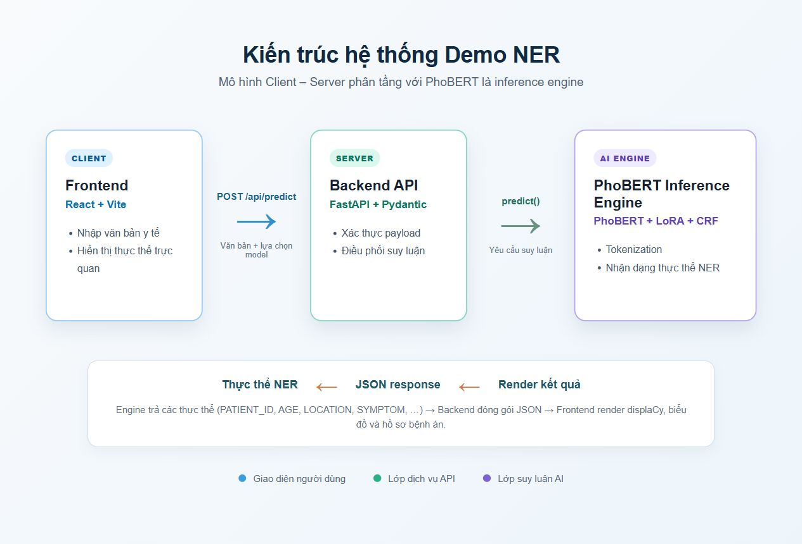
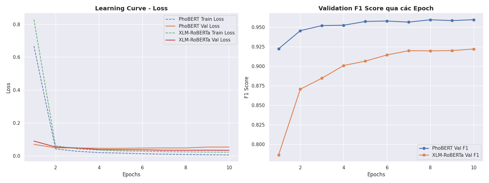
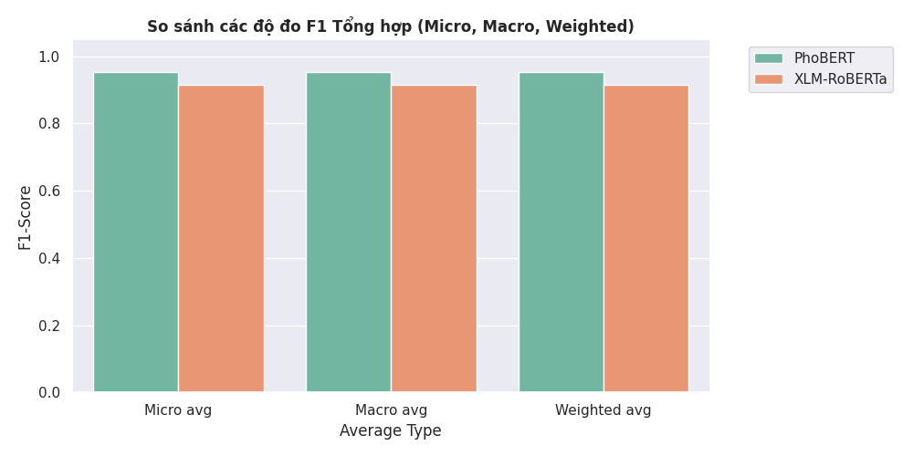
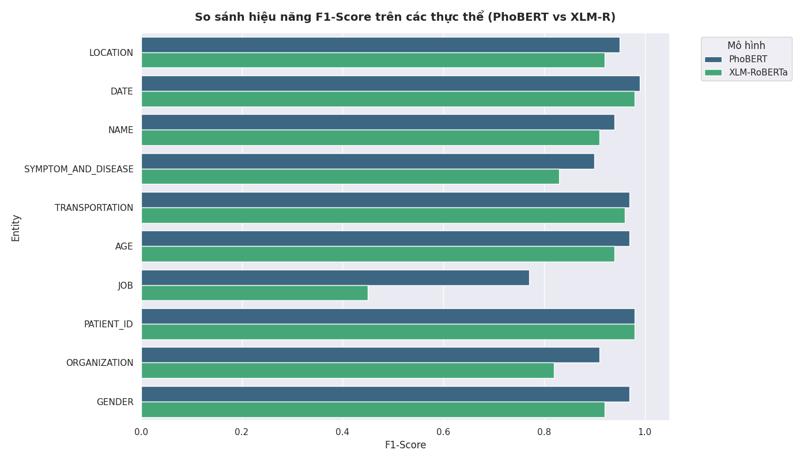
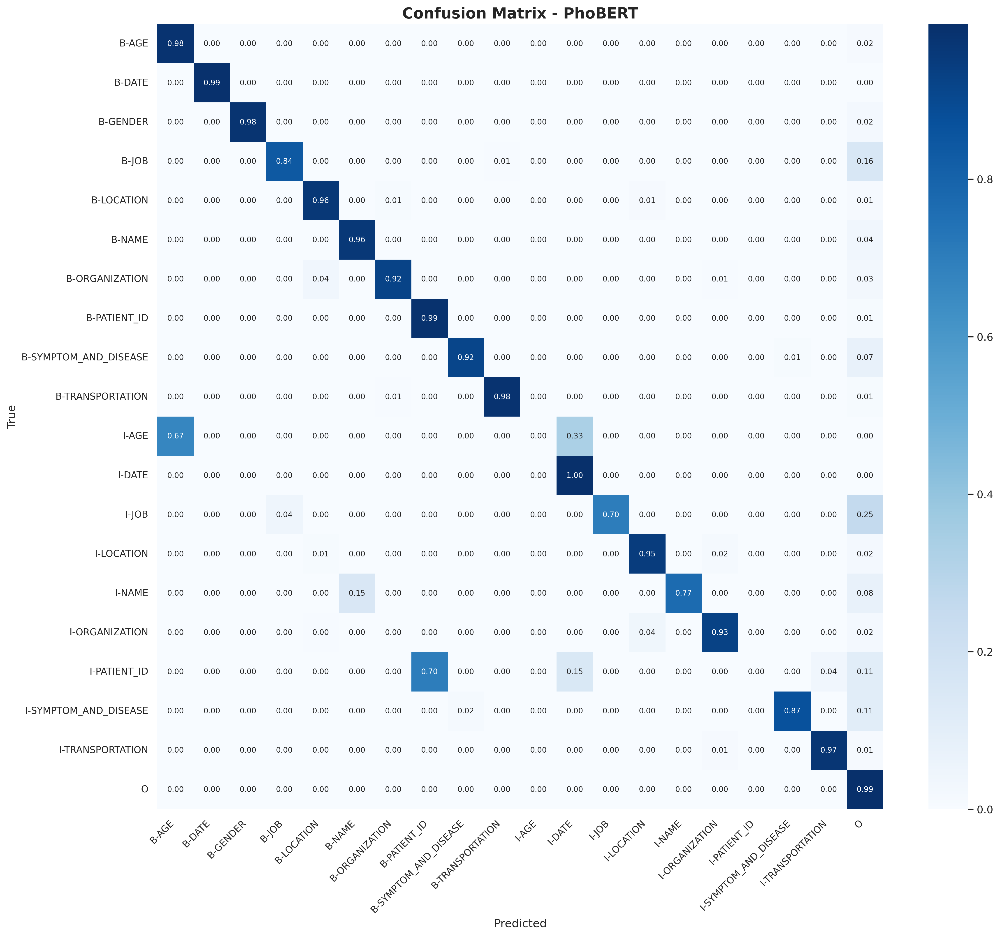
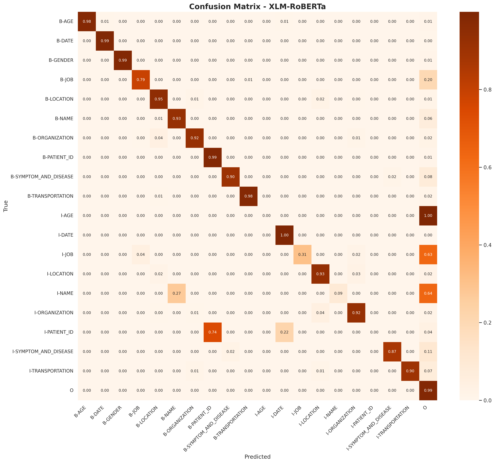

# PhoBERT và XLM-RoBERTa cho NER tiếng Việt trong ngữ cảnh COVID-19

Dự án xây dựng, so sánh và triển khai mô hình **Named Entity Recognition (NER)** cho văn bản tiếng Việt liên quan đến dịch COVID-19. Hai mô hình được fine-tune trên bộ dữ liệu **PhoNER_COVID19** là:

- **PhoBERT-base-v2 + LoRA + CRF** — mô hình tiếng Việt chuyên biệt.
- **XLM-RoBERTa-base + LoRA + CRF** — mô hình đa ngôn ngữ để đối chiếu và hỗ trợ kịch bản mở rộng sang ngôn ngữ khác.

Ngoài pipeline huấn luyện, repository có ứng dụng demo gồm FastAPI và React để nhập văn bản, chọn mô hình, xem thực thể được tô sáng, biểu đồ quan hệ và JSON kết quả.

> Lưu ý: đây là dự án nghiên cứu/demo. Kết quả NER không thay thế việc xác minh nghiệp vụ hoặc quyết định y khoa.

## Mục lục

- [Bài toán và dữ liệu](#bài-toán-và-dữ-liệu)
- [Cấu trúc thư mục](#cấu-trúc-thư-mục)
- [Mô hình và phương pháp](#mô-hình-và-phương-pháp)
- [Cài đặt và chạy demo](#cài-đặt-và-chạy-demo)
- [Tải model đã huấn luyện sẵn](#tải-model-đã-huấn-luyện-sẵn)
- [Huấn luyện và đánh giá](#huấn-luyện-và-đánh-giá)
- [Kết quả và trực quan hóa](#kết-quả-và-trực-quan-hóa)
- [Tài liệu tham khảo](#tài-liệu-tham-khảo)
- [Nhóm thực hiện](#nhóm-thực-hiện)

## Bài toán và dữ liệu

NER là bài toán gán nhãn cho từng token trong câu và ghép các token liên tiếp thành thực thể có nghĩa. Ví dụ, với câu `Bệnh nhân 1234, 32 tuổi, điều trị tại Bệnh viện Chợ Rẫy ngày 15/08`, mô hình có thể nhận ra mã bệnh nhân, tuổi, tổ chức và thời gian.

Dữ liệu đầu vào sử dụng định dạng CoNLL: mỗi dòng chứa một token và nhãn BIO tương ứng; các câu được ngăn bởi dòng trống. Pipeline hiện dùng phiên bản `word` của PhoNER_COVID19. Bộ nhãn xuất hiện trong notebook gồm:

`LOCATION`, `GENDER`, `SYMPTOM_AND_DISEASE`, `PATIENT_ID`, `TRANSPORTATION`, `DATE`, `NAME`, `ORGANIZATION`, `AGE`, `JOB`.

Quy ước BIO đánh dấu biên thực thể: `B-` là token mở đầu, `I-` là token tiếp diễn và `O` là token ngoài thực thể. Vì nhãn `O` và một số lớp như `JOB` phân bố không cân bằng, đánh giá chính dựa trên F1 ở cấp thực thể thay vì accuracy đơn thuần.

## Cấu trúc thư mục

```text
phobert-vietnamese-ner/
├── backend/                         # FastAPI phục vụ suy luận
│   ├── main.py                       # Khai báo API, CORS và endpoint
│   └── ner_engine.py                 # Load/switch PhoBERT hoặc XLM-R, hậu xử lý span
├── frontend/                         # Giao diện React + Vite
│   ├── src/
│   │   ├── components/               # Highlight, graph, dossier, JSON, sidebar, ...
│   │   ├── App.jsx                   # Màn hình ứng dụng chính
│   │   └── main.jsx                  # Điểm khởi chạy React
│   ├── public/figures/               # Tài nguyên minh họa cho frontend
│   └── package.json                  # Scripts và dependencies JavaScript
├── scripts/                          # Script huấn luyện độc lập
│   ├── train_phobert.py              # PhoBERT + LoRA + CRF
│   └── train_xlmr.py                 # XLM-RoBERTa + LoRA + CRF
├── src/                              # Thành phần dùng chung cho training
│   ├── dataloader.py                 # Đọc CoNLL thành Hugging Face Dataset
│   └── augment.py                    # Tăng cường dữ liệu bằng hoán đổi thực thể
├── PhoNER_COVID19-main/              # Dữ liệu và hướng dẫn gán nhãn gốc
│   └── data/
│       ├── word/                     # train/dev/test dạng word-level (.conll, .json)
│       └── syllable/                 # train/dev/test dạng syllable-level
├── trained_models/                   # Checkpoint và tokenizer cục bộ (không nên commit weights lớn)
│   ├── phobert-base-v2/              # Tokenizer/cấu hình PhoBERT cục bộ
│   └── xlm-roberta/                  # Adapter/tokenizer XLM-R cục bộ
├── report                            # Báo cáo dự án
├── figures/                          # Hình được sinh từ notebook phân tích
├── model_comparison.ipynb            # EDA, train và so sánh hai mô hình
├── requirements.txt                  # Dependencies Python
└── README.md
```

Một số thư mục như `runs/` (TensorBoard) và checkpoint tốt nhất có thể được tạo khi train. Chúng không nhất thiết tồn tại ở bản clone mới.

## Mô hình và phương pháp

### PhoBERT

PhoBERT là mô hình ngôn ngữ tiền huấn luyện dành riêng cho tiếng Việt, dựa trên kiến trúc RoBERTa. Với dữ liệu tiếng Việt đã tách từ, PhoBERT tận dụng tokenizer BPE và biểu diễn ngữ cảnh đã được học từ kho ngữ liệu tiếng Việt lớn. Trong dự án, mỗi từ trong dữ liệu được mã hóa thành một hoặc nhiều subword; chỉ subword đầu tiên nhận nhãn BIO, các subword còn lại được bỏ qua khi tính loss (`-100`).

Đây là lựa chọn phù hợp nhất khi dữ liệu đầu vào chủ yếu là tiếng Việt, vì backbone đã được tối ưu cho đặc điểm từ vựng và ngữ cảnh của tiếng Việt.

### XLM-RoBERTa (XLM-R)

XLM-RoBERTa là phiên bản đa ngôn ngữ của RoBERTa, được tiền huấn luyện trên dữ liệu CommonCrawl của hơn 100 ngôn ngữ. Trong dự án, XLM-R đóng vai trò baseline đa ngôn ngữ: tokenizer SentencePiece ánh xạ token đầu vào sang subword, sau đó nhãn được căn chỉnh bằng `word_ids()` của Hugging Face.

XLM-R phù hợp khi cần một mô hình chung cho nhiều ngôn ngữ hoặc muốn khảo sát khả năng transfer learning. Với bài toán chỉ có tiếng Việt, hiệu năng thực nghiệm hiện tại thấp hơn PhoBERT, nhưng mô hình vẫn là một đối chứng có giá trị.

### LoRA + CRF

Cả hai backbone đều được fine-tune bằng cùng một hướng tiếp cận:

- **LoRA (Low-Rank Adaptation):** chèn các ma trận hạng thấp vào một số lớp attention thay vì cập nhật toàn bộ trọng số backbone. Điều này giảm số tham số cần học và chi phí bộ nhớ.
- **Dropout + linear classifier:** biến embedding theo từng token thành điểm phát xạ cho các nhãn BIO.
- **CRF (Conditional Random Field):** học xác suất chuyển tiếp giữa các nhãn trong chuỗi, giúp hạn chế các chuỗi không hợp lệ như `O → I-LOCATION` mà không có `B-LOCATION` trước đó.
- **Data augmentation:** script có thể sinh thêm mẫu bằng cách hoán đổi thực thể thuộc lớp hiếm, mặc định nhắm tới `JOB`.

Các siêu tham số chính trong script: 10 epoch, batch size 16, `max_length=128`, LoRA rank 16, alpha 32, dropout 0,1 và warmup 10%. Hãy xem `model_comparison.ipynb` hoặc báo cáo dự án để biết phân tích đầy đủ.

<p align="center">
  
</p>

<p align="center"><em>Kiến trúc tổng quan: backbone Transformer → LoRA → token classifier → CRF.</em></p>

| Tiêu chí | PhoBERT-base-v2 | XLM-RoBERTa-base |
|---|---|---|
| Phạm vi ngôn ngữ | Tiếng Việt | Đa ngôn ngữ |
| Tokenizer | BPE, phù hợp dữ liệu đã tách từ tiếng Việt | SentencePiece |
| Vai trò trong dự án | Mô hình ưu tiên cho tiếng Việt | Baseline/tuỳ chọn đa ngôn ngữ |
| Căn chỉnh nhãn | Thủ công theo subword | Qua `word_ids()` |

## Cài đặt và chạy demo

### Yêu cầu

- Python 3.10+ (khuyến nghị có GPU CUDA khi huấn luyện)
- Node.js 16+ và npm (để chạy frontend)

### Cài đặt dependencies

```bash
git clone <repository-url>
cd phobert-vietnamese-ner

python -m venv .venv
# Windows PowerShell
.\.venv\Scripts\Activate.ps1
pip install -r requirements.txt

cd frontend
npm install
cd ..
```

### Tải model đã huấn luyện sẵn

Nếu chỉ muốn test hoặc demo mà không có thời gian huấn luyện, hãy tải bộ model đã train sẵn từ Google Drive: [Pre-trained Models – Google Drive](https://drive.google.com/drive/folders/1tdACXlSSQkGzdEDCa9EUhtzzRDiHTf1I?usp=drive_link) (khoảng 2,1 GB).

Bộ tải xuống gồm:

- `best_phobert_lora.pt`: checkpoint PhoBERT + LoRA + CRF đã fine-tune (khoảng 500 MB).
- `phobert-base-v2/`: PhoBERT base model và tokenizer (khoảng 500 MB), bao gồm `config.json`, `pytorch_model.bin`, `tokenizer.json`, `bpe.codes` và `vocab.txt`.
- `best_xlmr_lora.pt`: checkpoint XLMR + LoRA + CRF đã fine-tune (khoảng 1 GB MB).
- `xlm-roberta/`: XLM-RoBERTa base model và tokenizer (khoảng 18 MB), bao gồm `adapter_config.json`, `adapter_model.safetensors`, `tokenizer.json` và `tokenizer_config.json`.

Tải toàn bộ thư mục `trained_models` (hoặc từng tệp tương ứng) rồi đặt tại thư mục gốc của dự án theo cấu trúc sau:

```text
phobert-vietnamese-ner/
└── trained_models/
    ├── best_phobert_lora.pt
    └── phobert-base-v2/
        ├── config.json
        ├── pytorch_model.bin
        ├── tokenizer.json
        ├── bpe.codes
        └── vocab.txt
    ... (tương tự cho XLM-RoBERTa)
```

Có thể kiểm tra nhanh vị trí file trước khi chạy backend:

```bash
# Linux/macOS
ls -lh trained_models/best_phobert_lora.pt
ls -lh trained_models/phobert-base-v2/

# Windows PowerShell hoặc Command Prompt
dir trained_models\best_phobert_lora.pt
dir trained_models\phobert-base-v2\
```

Khi các tệp trên đã đúng vị trí, bạn có thể chạy ứng dụng web ngay. Nếu chưa tải model, backend vẫn chạy ở **Smart Demo Mode** với rule-based NER engine để demo giao diện; kết quả ở chế độ này có độ chính xác thấp hơn và không phải dự đoán của mô hình neural.

### Khởi chạy ứng dụng web

Mở hai terminal ở thư mục gốc dự án.

```bash
# Terminal 1: backend
cd backend
python main.py
```

API chạy tại `http://127.0.0.1:8000`; Swagger UI tại `http://127.0.0.1:8000/docs`.

```bash
# Terminal 2: frontend
cd frontend
npm run dev
```

Mở địa chỉ Vite hiển thị trong terminal (thường là `http://localhost:5173`). Người dùng có thể chọn `phobert` hoặc `xlm-roberta`, nhập văn bản và xem thực thể được đánh dấu.

Endpoint suy luận:

```bash
POST http://127.0.0.1:8000/api/predict
Content-Type: application/json

{
  "text": "Bệnh nhân 1234, 32 tuổi, điều trị tại Bệnh viện Chợ Rẫy.",
  "model": "phobert"
}
```

`GET /api/health` cho biết checkpoint nào đang khả dụng. Khi checkpoint cục bộ chưa có, backend chuyển sang **Smart Demo Mode** dùng luật; kết quả ở chế độ này không phải dự đoán của mô hình neural.

## Huấn luyện và đánh giá

Dữ liệu mặc định nằm ở `PhoNER_COVID19-main/data/word/` với ba file `train_word.conll`, `dev_word.conll` và `test_word.conll`.

```bash
# Huấn luyện PhoBERT + LoRA + CRF
python scripts/train_phobert.py

# Huấn luyện XLM-RoBERTa + LoRA + CRF
python scripts/train_xlmr.py
```

Hai script sẽ tải backbone từ Hugging Face nếu chưa có cache, ghi TensorBoard log vào `runs/` và lưu checkpoint vào `trained_models/`. Có thể theo dõi log bằng:

```bash
tensorboard --logdir runs
```

Để tái tạo toàn bộ EDA, biểu đồ và phép so sánh được mô tả dưới đây, mở và chạy [model_comparison.ipynb](model_comparison.ipynb). Notebook là nguồn tham chiếu cho các số liệu trong README; kết quả có thể thay đổi theo seed, thiết bị và cấu hình chạy.

## Kết quả và trực quan hóa

Notebook lưu một lần chạy 10 epoch cho thấy PhoBERT tốt hơn XLM-R trên test set của lần chạy đó:

| Mô hình | Test micro-F1 | Test macro-F1 | Best validation F1 |
|---|---:|---:|---:|
| PhoBERT + LoRA + CRF | 0,95 | 0,95 | 0,9596 |
| XLM-RoBERTa + LoRA + CRF | 0,91 | 0,92 | 0,9220 |

Đây là số liệu tái hiện từ output đã lưu trong notebook, không phải khẳng định tổng quát cho mọi cấu hình. Các lớp ít mẫu, điển hình là `JOB`, là nơi chênh lệch giữa các mô hình rõ hơn; vì vậy nên đọc cả F1 theo nhãn thay vì chỉ nhìn micro-F1.

<p align="center">
  
</p>

<p align="center">
  
  
</p>

| Hình | Nội dung nên đọc |
|---|---|
| [Phân bố độ dài câu](figures/seq_len_dist.png) | Kiểm tra giả định `max_length=128` có bao phủ phần lớn câu hay không. |
| [Phân bố nhãn](figures/tag_distribution.png) | Nhận biết mất cân bằng lớp và lý do dùng augmentation/F1. |
| [Learning curves](figures/learning_curves.png) | So sánh train/validation loss và validation F1 theo epoch. |
| [F1 tổng hợp](figures/overall_metrics_comparison.png) | So sánh micro, macro và weighted F1. |
| [F1 theo thực thể](figures/model_comparison_f1.png) | Xem mô hình nào mạnh/yếu ở từng loại thực thể. |
| [Confusion matrix PhoBERT](figures/confusion_matrix_phobert.png) · [XLM-R](figures/confusion_matrix_xlm-roberta.png) | Quan sát nhầm lẫn giữa các nhãn BIO và biên thực thể. |

Ứng dụng web trực quan hóa kết quả suy luận theo bốn dạng: thực thể tô sáng kiểu displaCy, knowledge graph, patient dossier và JSON thô. Các thành phần này giúp kiểm tra span, nhãn, confidence và mối quan hệ trình bày của kết quả; chúng không phải là thước đo đánh giá thay thế cho F1 trên test set.

<p align="center">
  
  
</p>

<p align="center"><em>Confusion matrix chuẩn hóa theo nhãn BIO của PhoBERT (trái) và XLM-RoBERTa (phải).</em></p>

## Tài liệu tham khảo

1. Devlin, J. et al. (2019). *BERT: Pre-training of Deep Bidirectional Transformers for Language Understanding*. NAACL. [Paper](https://aclanthology.org/N19-1423/) · nền tảng Transformer encoder hai chiều và fine-tuning theo tác vụ.
2. Liu, Y. et al. (2019). *RoBERTa: A Robustly Optimized BERT Pretraining Approach*. [arXiv](https://arxiv.org/abs/1907.11692) · biến thể tối ưu hóa quy trình tiền huấn luyện BERT, là cơ sở kiến trúc của PhoBERT/XLM-R.
3. Nguyen, D. Q. và Nguyen, A. T. (2020). *PhoBERT: Pre-trained language models for Vietnamese*. Findings of EMNLP. [Paper](https://aclanthology.org/2020.findings-emnlp.92/) · mô hình tiếng Việt được sử dụng trong dự án.
4. Conneau, A. et al. (2020). *Unsupervised Cross-lingual Representation Learning at Scale*. ACL. [Paper](https://aclanthology.org/2020.acl-main.747/) · XLM-RoBERTa đa ngôn ngữ.
5. Tjong Kim Sang, E. F. & De Meulder, F. (2003). *Introduction to the CoNLL-2003 Shared Task: Language-Independent Named Entity Recognition*. [Paper](https://aclanthology.org/W03-0419/) · tài liệu nền tảng về thiết lập NER; xem thêm [seqeval](https://github.com/chakki-works/seqeval) để tính precision, recall và F1 cho sequence labeling.
6. Lafferty, J., McCallum, A. & Pereira, F. (2001). *Conditional Random Fields: Probabilistic Models for Segmenting and Labeling Sequence Data*. ICML. [Paper](https://repository.upenn.edu/entities/publication/a71f1374-4e37-44ad-a123-c1275d94f75a) · nền tảng lý thuyết cho lớp CRF.
7. Hu, E. J. et al. (2022). *LoRA: Low-Rank Adaptation of Large Language Models*. ICLR. [Paper](https://openreview.net/forum?id=nZeVKeeFYf9) · phương pháp fine-tune hiệu quả tham số.
8. [PhoNER_COVID19](https://github.com/VinAIResearch/PhoNER_COVID19) · dữ liệu, mô tả và hướng dẫn annotation mà dự án sử dụng.

## Nhóm thực hiện - UET - VNU

- Hoàng Công Khôi — 24022371 
- Trương Huy Hoàng — 24022341
- Phạm Danh Thái — 24022449

## License

Mã nguồn được phát hành theo [MIT License](LICENSE). Dữ liệu và các mô hình tiền huấn luyện tuân theo điều khoản của nguồn phát hành tương ứng.
